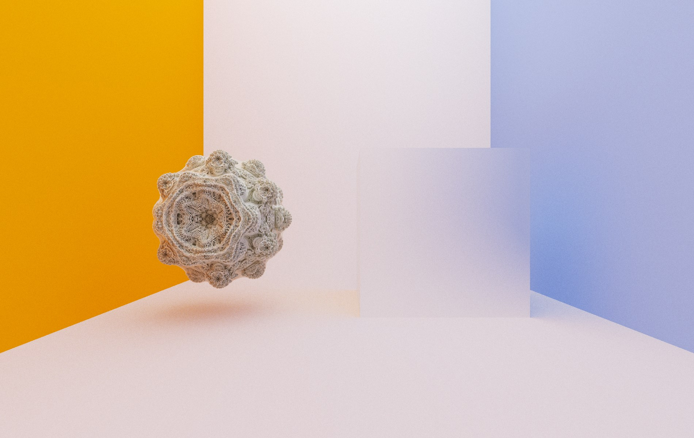
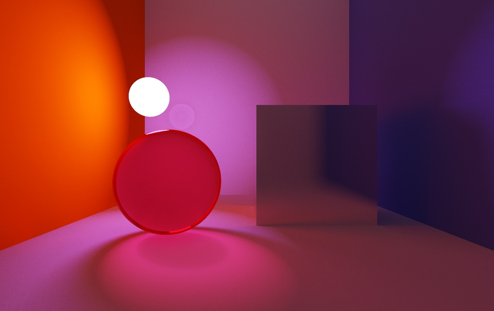
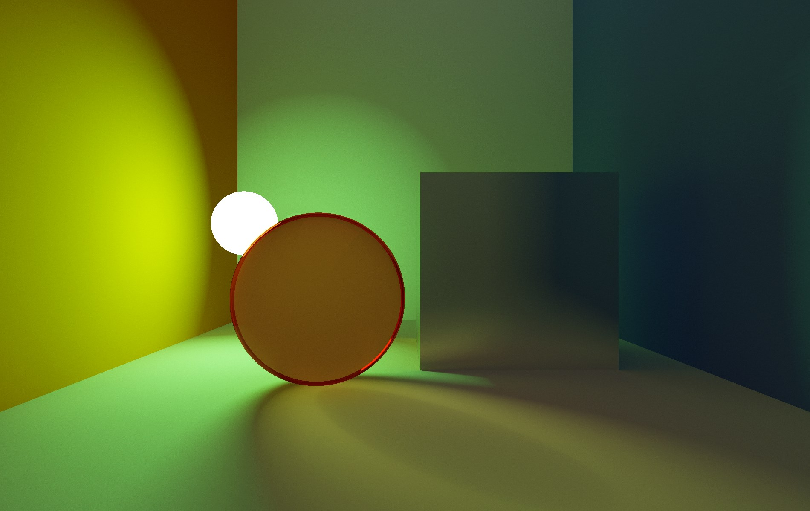

## 3D Browser Engine by Scrip0

**This project** uses **GLSL shader** and pure **WebGL** library for **JavaScript** to **raytrace** different objects, materials and even **fractals**. 

***Examples:***
| Example 1 | Example 2 | Example 3 |
| :---: | :---: | :---: |
|  |  |  |

## Supported features
It supports such objects as:
- Planes
- Spheres
- Rectangles
- Fractals
- Any other objects with known distance formula

Materals and values:
- Mirror (-1.)
- Glass (-2.)
- Matte ([0.0;1.0])
- Light ((-inf;-3.))

Render type:
- Static
- Dynamic (free cam)

## Run project on your PC

Download the project and open **index.html**. Use **wasd** keys and your **mouse** to move around.
